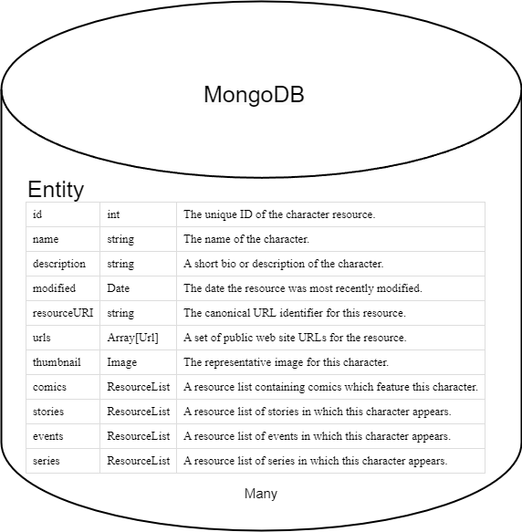
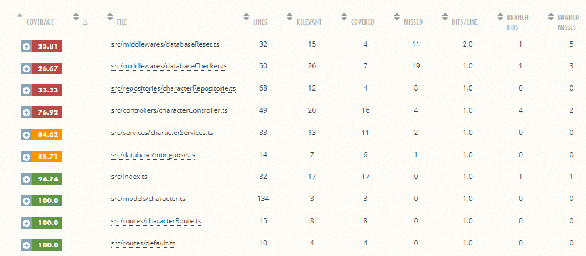

# **Marvel app**

[](https://github.com/nicovegasr/marvel-api/actions/workflows/coverage.yml)
[](https://github.com/nicovegasr/marvel-api/actions/workflows/test.yml)
[](https://coveralls.io/github/nicovegasr/marvel-api?branch=master)
[](https://sonarcloud.io/summary/new_code?id=nicovegasr_marvel-api)

## Entendiendo el desafío:
* Api a consumir: [marvel](https://developer.marvel.com/docs)
* Objetivo: Hacer una API con 1 endpoint /character con 2 rutas:
  * /chatacter/:id : Busca en una base de datos el personaje de marvel cuyo id coincida.
  * /chatacter/:name: Busca en una base de datos el personaje de marvel cuyo nombre coincida.
* Base de datos a usar: [MongoDB Atlas](https://www.mongodb.com/atlas/database)

## Flujo de la API:

Lo primero que tenemos que entender son los personajes de la api de marvel, estos siguen el siguiente esquema:



Teniendo esto en cuenta tendremos las siguientes carpetas:

* **Models**: Se encargará del modelo que se almacenará en moongose con el nombre de colección **Character**, además dicho modelo implementará su interfaz correspondiente que está dividida en distintas interfaces para modelar el héroe de marvel correspondiente.
* **Repositories**: Contendrá una clase que **CharacterRepositorie** que se encargará de representar el comportamiento de todas nuestras peticiones a la base de datos con respecto a dicha colección.
* **Services**: Esta carpeta se centrará en la lógica de negocios, desconociendo los protocolos HTTP para encapsular lo máximo las funcionalidades siguiendo un poco la filosofía *Dont ask, tell*.
* **Controllers**: Se encarga de manejar todas las peticiones HTTP dependiendo del comportamiento de los servicios.
* **Routes**: Contiene las rutas de la aplicación mencionadas anteriormente con una por defecto añadida para manejar todas las rutas por defecto devolviendo un **501: Not Implemented**.
* **Middlwares**: Contaremos con 2 middlewares que usaran nuestras rutas:
  * **DatabaseReset**: En caso de que el dia actual difiera de la ultima modificacion en nuestra coleccion, hace un drop de la base de datos para volver a rellenarla en el siguiente middlware, esto nos asegura que tenemos todos los días nuestra base de datos actualizada.
  * **DatabaseChecker**: Se encarga de revisar si nuestra base de datos está vacía, en caso de estarlo hace una petición a la API de marvel y mediante nuestro repositorio almacena los héros correspondientes y pasa al siguiente middlware o controlador, en caso contrario devuelve un codigo de error.

El flujo de la API en la primera petición de cada día sería:

1. El usuario hace una peticion get ya sea por id o nombre.
2. La API confirma que es un día nuevo y borra la base de datos.
3. Se verifica si hay elementos de la colección Character, visto que no se procede a llamar a la api de marvel con las credenciales privadas manejadas con variables de entorno y se rellena la base de datos por medio del repositorio **CharacterRepositorie**.
4. Se llama al controlador correspondiente que a su vez utiliza el servicio y este último busca en el repositorio el héros. En caso de existir, se envía, en caso contrario se comunica mediante un **404:Not Found** 

## Instrucciones para replicar funcionamiento:
* Clonar el repositorio.
* Ejecutar npm install para tener las dependencias.
* Crear en el directorio raiz .env.development que contendrá:
  * PUBLIC_API_KEY=``Tu clave pública de la API de marvel``
  * PRIVATE_API_KEY=``Tu clave privada de la API de marvel``
  * PORT=``Puerto donde se ejecutará tu API``
  * URL_DATABASE=``URL de tu base de datos de moongose.``

## Testing:
Para desarrollar los tests de la API se utilizó jest con supertest aunque es la parte más débil de la aplicación por problemas con el CI/CD de Github, en un futuro se podria plantear mejorarse. Sin embargo vemos que quitando las funcionalidades del middlewares que son las más difíciles de testear ya que tienen tiempos elevados de carga ya que en general se encargan de borrar la base de datos y volver a hacer una peticion a la api de marvel externa para actualizar la información, el resto de ficheros tienen un porcentaje alto de cubrimiento:

## Dockerfile:
```docker
FROM node:18-alpine
WORKDIR /app
COPY . .
EXPOSE 4000
CMD ["npm", "start"]
```
Comandos de ejemplo para crear la imágen y ejecutarla en un contenedor:
* ``sudo docker build . -t node-api-marvel:latest``
* ``sudo docker run --env-file=./.env.development  -p 4000:4000 node-api-marvel:latest``



> Despliegue: https://ejfitn-4000.csb.app/
* Ejemplos de solicitudes: 
  * https://ejfitn-4000.csb.app/character/name/Adam Destine
  * https://ejfitn-4000.csb.app/character/name/no existo
  * https://ejfitn-4000.csb.app//character/id/1011266  
  * https://ejfitn-4000.csb.app//character/id/1234